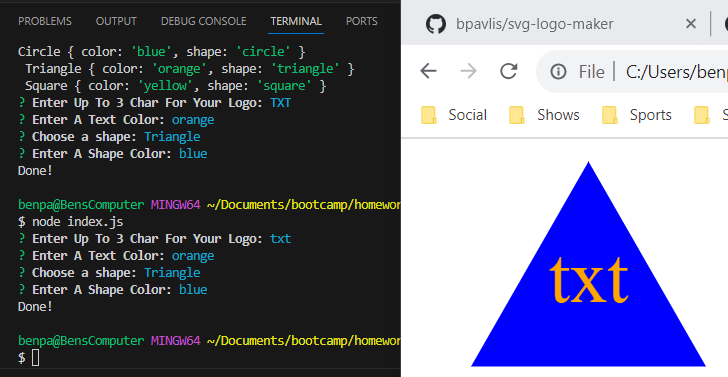

# Module 10 Challenge - SVG Logo Maker

## Description of Work
Created and tested a svg logo maker using npm, inquirer, fs, and jest.

## Final Screenshot

## Links
[GitHub](https://github.com/bpavlis/svg-logo-maker)

[GitHub Pages](https://bpavlis.github.io/svg-logo-maker/)

[Link To Working Video](https://drive.google.com/file/d/1x_3HcgMbaZ7KrMhU4nqSKIZVN_-Iox1P/view?usp=sharing)
